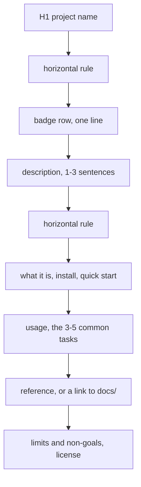

# readme-playbook

---

[](LICENSE)
[](https://github.com/alyekypo/readme-playbook/commits/main)
[](https://github.com/alyekypo/readme-playbook)
[](https://github.com/alyekypo/readme-playbook/stargazers)
[](https://github.com/alyekypo/readme-playbook/pulls)
[](https://github.github.com/gfm/)
[](https://mermaid.js.org/)

Reference for writing a README that a stranger can act on: the header block and its order, how to pick a badge set and a badge size, when a diagram or a table earns its place, which claims have to be verifiable, and where the point of bloat starts. Every rendering fact below was probed against GitHub's markdown API and is quoted with its result.

---

## Contents

- [The header block](#the-header-block)
- [Badges](#badges)
- [The body, in order](#the-body-in-order)
- [Diagrams](#diagrams)
- [Tables](#tables)
- [Stack](#stack)
- [Verified claims](#verified-claims)
- [Length and layering](#length-and-layering)
- [Rendering facts](#rendering-facts)
- [Dark mode, accessibility, localization](#dark-mode-accessibility-localization)
- [Anti-patterns](#anti-patterns)
- [Checklist before publishing](#checklist-before-publishing)
- [License](#license)

## The header block

Five lines, in this order. Everything before the first scroll decides whether the reader keeps reading.

| Line | Content | Why it is here |
| --- | --- | --- |
| 1 | `# project-name` | The only H1. One per file, never two, never styled with emoji |
| 2 | `---` | A rule that renders in every viewer; separates the title from the metadata chrome |
| 3 | Badge row, one line, space separated | Answers the reader's first four questions - license, activity, size, is it alive - without prose |
| 4 | One paragraph, one to three sentences | What it is, who it is for, which problem it removes, in that order. No taglines, no adjectives |
| 5 | `---` | Closes the front page block. Everything below is reference material |

Two variants are common and both are defensible: a rule above and below the badge row (this file), or one rule after the description. Pick one and keep it across your repositories, because the reader learns your layout once. What does not work is badges sprinkled through the document, a second H1 further down, or a header whose badge row wraps onto a second line.

The divider is the only decorative element worth having. Markdown's horizontal rule is the one form that survives GitHub, npm, GitLab, VS Code preview, `glow` and plain pagers:

| Divider | Renders as | Verdict |
| --- | --- | --- |
| `---` | `<hr>` (probed: 1 rule in the output for 1 in the input) | Recommended |
| `***`, `___` | the same `<hr>` | Equivalent, less common |
| `<hr>` | the same `<hr>` | Equivalent, noisier source |
| A line of `-`, `=`, `_` or box-drawing characters | Plain text, different width per font and viewer | Avoid: alignment breaks the moment the font changes |
| An image of a line | A network request that can 404 | Avoid: an offline or blocked reader sees a broken image |
| Emoji or symbol rules | Rendered as text with unpredictable width | Avoid |

## Badges

### What a badge has to answer

A badge is a compressed claim with a link attached. Before adding one, finish the sentence "the reader now knows ___." If the sentence is empty, the badge is decoration.

The four claims worth the space, in priority order: the legal status (license), that the project is alive (last commit or release), that using it has a bounded cost (size, runtime, dependency count), and that contributions are wanted. Everything else is domain specific and has to justify itself individually: build status, coverage, minimum runtime version, download count, package version, documentation status.

### Anatomy of a shields.io badge

```text
https://img.shields.io/<provider>/<subject>/<value>?<query>
https://img.shields.io/badge/<subject>-<value>-<color>?<query>
```

| Query | Effect | Note |
| --- | --- | --- |
| `style=flat-square` | Square corners, 20 px tall | The default choice for a row |
| `style=flat` | Rounded corners, same size | Fine, slightly softer |
| `style=plastic` | 18 px tall, gradient | Dated |
| `style=for-the-badge` | 28 px tall, uppercase, much wider | One to three badges maximum |
| `style=social` | Counts in a social style | Standalone, never mixed into a normal row |
| `label=` | Overrides the left text | Use when the provider's wording is unclear |
| `logo=<slug>`, `logoColor=` | Adds an icon | Measured effect: widens the badge, use sparingly |
| `color=` | Fixes the right colour | Keep it out unless the colour carries meaning |

Dynamic providers (`github/license`, `github/last-commit`, `github/repo-size`, `github/stars`, `npm/v`, `github/actions/workflow/status`) ask the host for data on every render. Static `badge/` badges are text you typed. A dynamic badge is worth more, because it cannot silently go stale.

### An example set

The row at the top of this file, and why each badge is in it:

| Badge | Question it answers | Include when | Here |
| --- | --- | --- | --- |
| license | Can I legally use this in my project | Always, once a LICENSE file exists | yes |
| last commit | Is this maintained | Always, for anything published | yes |
| repo size | How heavy is a clone | Repos with assets, fixtures or vendored code | yes |
| stars | Is anyone else using it | Public libraries and tools | yes |
| PRs welcome | May I contribute | Repos that accept contributions and say so | yes |
| markup / format | Which dialect the files are written in | Content and documentation repos | yes |
| diagrams | Which tool renders the diagrams | Repos whose README contains diagrams | yes |
| build status | Does the current revision pass | Repos with CI | no CI here, so no badge |
| coverage | How much is tested | Repos that publish a coverage report | no report, so no badge |
| version | Which release is current | Published packages | not a package |

### A healthy set against badge inflation

| Signal | Healthy | Inflation |
| --- | --- | --- |
| Count | 3 to 7, one line | 12 and up, several rows |
| Origin | Hosts that read your repository state | Static text describing your own quality |
| Failure mode | A badge turns red or grey and tells you something | A badge cannot fail and cannot inform |
| Read time | One glance, no decoding | The reader scrolls past |
| Relevance | Every badge answers a question a user has | Badges copied from a template README |
| Consistency | One style, one height, one row | Mixed styles, heights and corner radii |

The test for a junk set is simple: remove half the badges and ask whether the reader lost information. If nothing is lost, they were decoration. Badges claiming things nobody measures - "awesome", "clean code", "100 percent", "blazing fast", a coverage badge with no coverage report, a build badge for a repository with no workflow - are worse than decoration, because they make every other claim on the page suspect.

### Style and size

Measured with the seven badges in this file, same content, only the style parameter changed:

| Style | Height | One badge, average of this set | Seven-badge row |
| --- | --- | --- | --- |
| `flat-square` | 20 px | 130 px | 912 px |
| `flat` | 20 px | 130 px | 912 px |
| `plastic` | 18 px | 130 px | 912 px |
| `for-the-badge` | 28 px | 197 px | 1379 px |
| `social` | 20 px | 136 px | 950 px, do not mix into a normal row |

Use the small styles (`flat-square`, `flat`) for the header row. Use `for-the-badge` only when the badge count is one to three and the badge is the point - a download page, a starter template, a project whose only claim is its platform. The same set costs 1379 px in the large style against 912 px in the small one, which is why large badges and a long set cannot coexist. Never mix sizes in one row; the 8 px height difference reads as a rendering bug. Compare the measured row against the width of the column you are read in and check the rendered page on a narrow window: if the row wraps, remove badges rather than shrinking the text.

### Truthfulness

| Claim | How to verify it | When it becomes a lie |
| --- | --- | --- |
| License | The `LICENSE` file, and GitHub's own detection in the About panel | The badge points at a licence you did not ship |
| Build status | The workflow the badge points at, run on the default branch | The workflow was deleted or never ran |
| Coverage | The report the host renders | The number is typed in by hand |
| Version | The registry the badge reads | The README is copied into a fork with a different version |
| Size | `git clone` or the host's own number | The number was copied once and never refreshed |
| PRs welcome | Your contributing policy | The repository ignores pull requests |

Every badge is a claim with an owner. If you cannot name the thing that would turn it red, it is not a badge, it is an assertion.

### Layout rules

- One row, one style, one height, and the whole row fits on a single line in the rendered column.
- Give every badge a link that goes somewhere useful: `LICENSE`, the workflow, the registry page, the release list. A badge that links nowhere wastes a click.
- Write alt text. The markdown form is `[](link)`; the alt text is what a screen reader announces and what shows when the image fails.
- Put the badge row after the H1 and before the description, or after the description and before the first rule. Nowhere else.
- Verify the row before publishing: `curl -sI <badge url> | head -1` for each badge must return `200`. Then check the rendered page once, because GitHub serves external images through its own proxy and a deleted badge shows as a broken image, not as an error.

## The body, in order

After the header, sections appear in the order a reader needs them, not in the order you built the project.

| Order | Section | Answers | Move out when |
| --- | --- | --- | --- |
| 1 | What it is | Two sentences more than the header, and the non-goals | Never |
| 2 | Install | The exact command, plus prerequisites and supported versions | Never |
| 3 | Quick start | The smallest input that produces visible output | Never |
| 4 | Usage | The three to five tasks most people do | More than five: move to `docs/` |
| 5 | Configuration | Options, defaults, units, one row each | More than ten options: `docs/configuration.md` |
| 6 | Architecture | One diagram, and only if the shape is not obvious | Never more than one |
| 7 | Project structure | The directories a contributor has to know | Large trees: show only top level |
| 8 | Stack | Runtime, language, framework, storage, deployment | Never, keep it a table |
| 9 | Limits and non-goals | What it does not do, and the known ceiling | Never |
| 10 | License | One line plus a link | Never |

Skip a section rather than writing a placeholder. An empty "Roadmap" heading with "coming soon" costs a reader a scroll and tells them the document is unfinished.

## Diagrams

### When a diagram earns its place

A diagram earns its place when the reader has to hold three or more things in their head at once and the relationship between them is not linear. That is the whole test.

- Earns it: request flow across processes, state machine with loops, data model with relationships, deployment topology, a decision tree with branches.
- Does not earn it: a linear three-step flow (write it as a numbered list), a directory tree (use a code fence), anything you can express in one sentence, a repeat of the table directly above it.

Rules: one diagram per README in most projects, up to three in an architecture document; label every edge with what it carries; keep it under about seven nodes; state what the diagram does not show; and keep the source in the repository so the diagram can be changed in review.

### Which form

| Form | Renders on GitHub | Diffs in review | Use when |
| --- | --- | --- | --- |
| Mermaid in a fenced block | Yes, on the repository page | Yes, text | The default for flowcharts, sequences, states, ER |
| ASCII in a fenced block | Everywhere, including terminals | Yes, text | Two to five boxes, or a layout sketch |
| A committed image | Yes | No, binary | Screenshots of real UI, or a design that cannot be expressed as code |
| An image on an external host | Yes, through GitHub's proxy | No | Avoid: the host goes down and the image disappears |

One nuance worth knowing before you trust a checker: GitHub's markdown API renders a Mermaid fence as a highlighted code block, not as a diagram (probed: the output contained `highlight-source-mermaid` and no SVG). Mermaid is rendered by the repository page. Verify diagrams on the page, and verify everything else with the API.

### The skeleton, as a diagram

The header block of this file, expressed the way a project's data flow would be:



### Over-diagramming

| Smell | What it costs | Replace with |
| --- | --- | --- |
| A diagram per section | The page becomes a slideshow; nothing is skimmable | One diagram, at the point the structure is genuinely unclear |
| Boxes with no labels on edges | The reader guesses the direction and payload | Label the edge, or delete the diagram |
| A diagram of a linear flow | Duplicates three lines of prose | A numbered list |
| A decorative illustration in the header | Bytes, an external request, no information | The badge row |
| A diagram that is not in the repository as text | Reviewers cannot see the change | Mermaid or ASCII in a fence |
| Two diagrams showing the same thing at different levels | Double maintenance, drift | Keep the one at the level of the reader |

## Tables

A table beats a list when each item has two or more attributes of the same kind, because the columns put the attributes next to each other and the reader can compare across rows. It is the wrong tool for a list of three items, for prose, and for anything with a blank cell.

| Rule | Reason |
| --- | --- |
| Header row in every table | The reader has no other way to know what a column means |
| One unit per column, stated in the header, not repeated in cells | `Timeout (s)` with `30`, not `30 s` in each cell |
| Two to five columns | A six-column table on a narrow screen wraps and becomes unreadable |
| Stable column order across the document | Comparison across tables is the point |
| No nested tables, no paragraphs inside cells | Renderers disagree, and mobile breaks |
| No table for three items | A list is shorter and scans faster |
| Fill every cell, or write why it is empty | A dash in a cell is an unanswered question |
| Numbers right-aligned where the renderer allows | Digits line up, differences become visible |

## Stack

State the stack as a table of facts, not as a wall of logos. A reader wants to know what they must install, what will run in production, and what they take on as a dependency.

| Row | Example | Verification |
| --- | --- | --- |
| Runtime and minimum version | Node 22.12 or later | The `engines` field, or the CI matrix |
| Language and version | TypeScript 5.9 | `tsconfig.json` |
| Framework | None | The dependency manifest |
| Storage | SQLite via `better-sqlite3` | The dependency manifest |
| Deployment | Static files, any host | The build output in the repository |
| Dependencies | 5 runtime packages | The manifest's dependency count |

What to leave out: logo walls (they are decoration and load slowly), every transitive dependency, tools used once during development, and anything you cannot check in the repository. A stack table is a promise about what the reader installs.

## Verified claims

Every number and every status on the page has an owner. The rule that keeps a README honest is that each claim names the thing that produced it.

| Claim type | Correct form | Failure mode when unowned |
| --- | --- | --- |
| Performance | The number, the workload, the environment, the revision | Copied once, stale within a release |
| Compatibility | A matrix of tested versions | The claim outlives the test |
| Status | A badge pointing at a host that reads the repository | Green forever because nothing runs |
| Size | The host's own number, or a command the reader can rerun | A sentence written by hand |
| Security | The policy, linked | A vague promise |

Two habits make this cheap: keep volatile numbers inside a badge so the host asks on every render, and put the command next to any number you typed by hand.

## Length and layering

A README is a front page, not a manual. The reference numbers:

| Element | Target | Smell |
| --- | --- | --- |
| Whole file | 150 to 400 lines | 500 and up means reference material is living in the wrong file |
| Header block | 5 lines | More than 8 |
| Badge row | 1 line, 3 to 7 badges | Wrapping, or a second row |
| Quick start | Under 15 lines | A quick start that needs its own table of contents |
| Diagrams | 1, at most 3 | One per section |
| Prose paragraphs | 1 to 3 sentences | Walls with no heading every screen |
| Sections | 8 to 12 | Every heading holds a subsection of one paragraph |

Layering, when the file has to shrink: a table of contents is the first symptom, a `docs/` directory is the cure. Move the material a reader consults into `docs/`, keep the material a reader executes in the README, and link once from the section that used to contain it. Deleting is allowed; a README that explains a feature the project dropped is worse than a short one.

## Rendering facts

Probed against `POST https://api.github.com/markdown` with `mode: gfm`, on the day this file was written. The result column is quoted from the response.

| Input | Result | Consequence for a README |
| --- | --- | --- |
| `---` | `<hr>` | The divider in the header block is safe and semantic |
| `<style>...</style>` | Escaped to visible text | You cannot style a README with CSS |
| `<script>...</script>` | Escaped to visible text | No behaviour, no analytics snippet |
| `<div style="color: red">` | `<div>` | Inline style attributes are stripped |
| GFM table | `<table role="table">` | Tables render, but the wrapper is not a plain `<table>` in the API output |
| Raw URL in an image | Rewritten to `camo.githubusercontent.com` with `data-canonical-src` | External images are proxied; a dead URL shows as a broken image |
| Every image | `style="max-width: 100%"` added | Wide screenshots shrink instead of overflowing |
| `<details>` and `<summary>` | Preserved | Long material can be collapsed instead of moved out |
| ` ```mermaid ` fence | Highlighted code block via the API, diagram on the repository page | Verify diagrams on the page, not through the API |
| `[text](#heading-anchor)` | Link preserved as written | Anchors are generated by the page renderer: lowercase, spaces to hyphens, punctuation dropped. Keep headings simple and let the anchor follow |

The last row is why the Contents list in this file uses short heading names: an anchor you cannot predict is a broken link you will not notice.

## Dark mode, accessibility, localization

- Dark mode: GitHub rewrites a `<picture>` with `<source media="(prefers-color-scheme: dark)">` and keeps both variants (probed: the markup survived and both sources were proxied). Use it for diagrams and screenshots that are unreadable on the opposite background, and prefer assets that work on both.
- Alt text on every image, including badges. The pattern `[](link)` gives the badge an accessible name and a target.
- Do not encode meaning in colour alone: state the result in the text of the cell or caption too.
- Tables and diagrams have to survive a narrow screen. A six-column table and a wide diagram both scroll horizontally on mobile, which is a reason to cut columns and nodes, not to shrink the font.
- Localization: one language per file, with a link row at the top if you ship several. Keep a single source of truth and translate on release; a translation that silently drifts is worse than no translation.

## Anti-patterns

| Anti-pattern | Why it fails |
| --- | --- |
| Emoji headings and emoji bullets | Breaks the outline, renders differently per platform, and adds no information |
| Badge inflation | Claims nothing can falsify; the reader stops believing the badges that matter |
| Marketing adjectives | "Blazing fast", "revolutionary", "best in class" are unfalsifiable and unverifiable |
| A screenshot where text would do | Not searchable, not quotable, and stale at the first UI change |
| A wall of prose with no headings | Unskimmable; the reader leaves to find the same fact elsewhere |
| Code examples that were never run | The reader's first experience is a failure |
| A placeholder section | Signals an unfinished document |
| Contributor walls, "made with love", attribution for tools | Noise; the contributor list belongs in the commits and the About panel |
| A second H1, or headings that skip levels | Breaks the outline and the generated anchors |
| Claims without an owner | Every number on the page becomes suspect |
| Instructions that assume one platform | State the platform, or give the command for each |
| A README that documents a deleted feature | Worse than a short README |

## Checklist before publishing

```bash
# every badge answers 200
grep -oE 'https://img\.shields\.io[^)"]+' README.md | while read -r url; do
  printf '%s %s\n' "$(curl -sI -o /dev/null -w '%{http_code}' "$url")" "$url"
done

# no dead relative links
grep -oE '\]\([^)#][^)]*\)' README.md | sort -u

# length, and the shape of the file
wc -l README.md
grep -c '^#' README.md

# the outline has one H1 and no skipped levels
grep -n '^#' README.md
```

Then read the rendered page once, on a narrow window, and answer four questions: does the badge row fit one line, does the first screen say what the project is, does the quick start run on a clean machine, and is every number on the page produced by something the reader could rerun.

## License

[MIT](LICENSE)